# AWS Cloud Infrastructure Lab

## Project Description

This project demonstrates the implementation of core AWS services including IAM, S3, EC2, networking configuration, and infrastructure replication. The lab focuses on creating secure access controls, launching and modifying EC2 instances, configuring network interfaces, and replicating infrastructure using AMI.

During this lab, an IAM user and group were created to implement controlled access to AWS services. A custom policy was designed to provide read-only access to a specific Amazon S3 bucket. The AWS CLI was configured using generated access credentials to interact with AWS resources programmatically.

An EC2 instance was then launched with a Linux operating system, configured with storage and an IAM role. The instance configuration was later modified by changing the instance type from t3.micro to t3.small and increasing the EBS volume size from 30 Gib to 50 Gib. Networking capabilities were expanded by creating and attaching an Elastic Network Interface (ENI), and security groups were configured to allow SSH(port 22) and HTTP(port 80) access.

Secure remote access to the instance was established using an SSH key pair. Finally, the EC2 instance was replicated by creating an Amazon Machine Image (AMI) and launching additional instances from it, demonstrating efficient infrastructure replication.

---

# AWS Services Used

- IAM (Identity and Access Management)
- Amazon S3
- Amazon EC2
- Amazon EBS
- Elastic Network Interface (ENI)
- Security Groups
- Amazon Machine Image (AMI)
- AWS CLI

---

# Project Architecture

---

# Phase 1 — IAM Setup

### IAM User Creation

### IAM Policy Creation

### IAM Group Creation

---

# Phase 2 — S3 Bucket Setup

### S3 Bucket Created
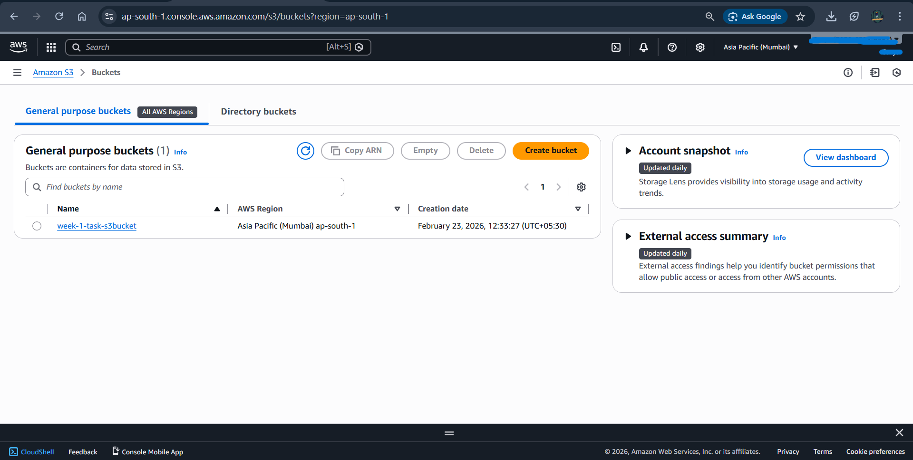

### Bucket Policy Configuration
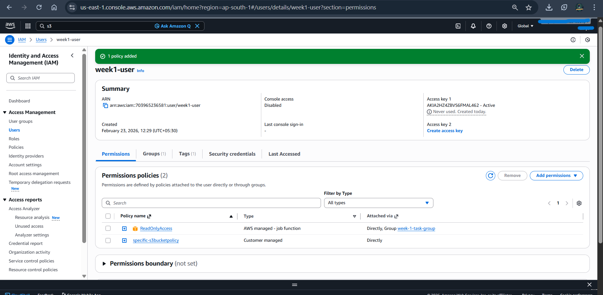

---

# Phase 3 — EC2 Deployment

### EC2 Instance Running
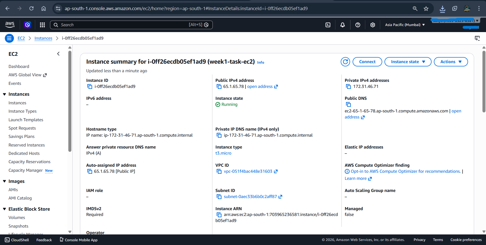

### IAM Role Attachment
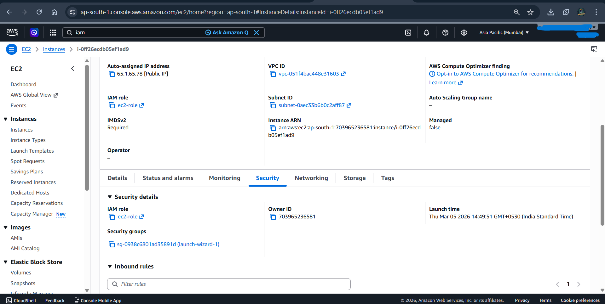

---

# Phase 4 — EC2 Modification

### Instance Type Change

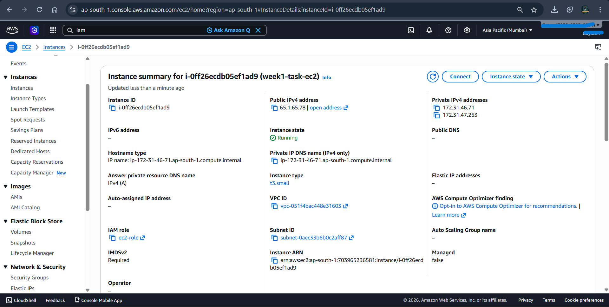

### Volume Resize

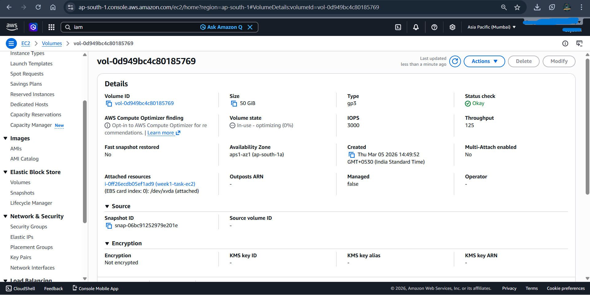

---

# Phase 5 — Networking Configuration

### ENI Creation
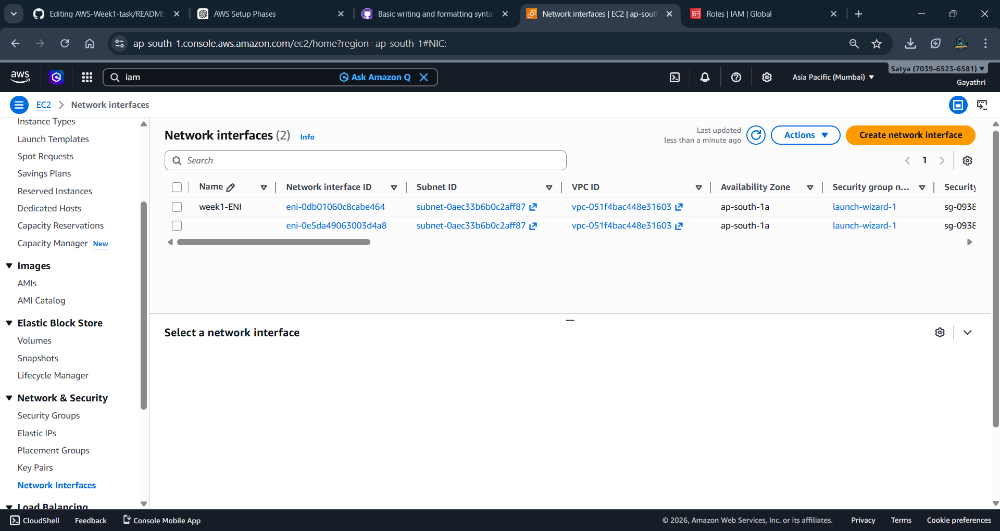

### ENI Attachment
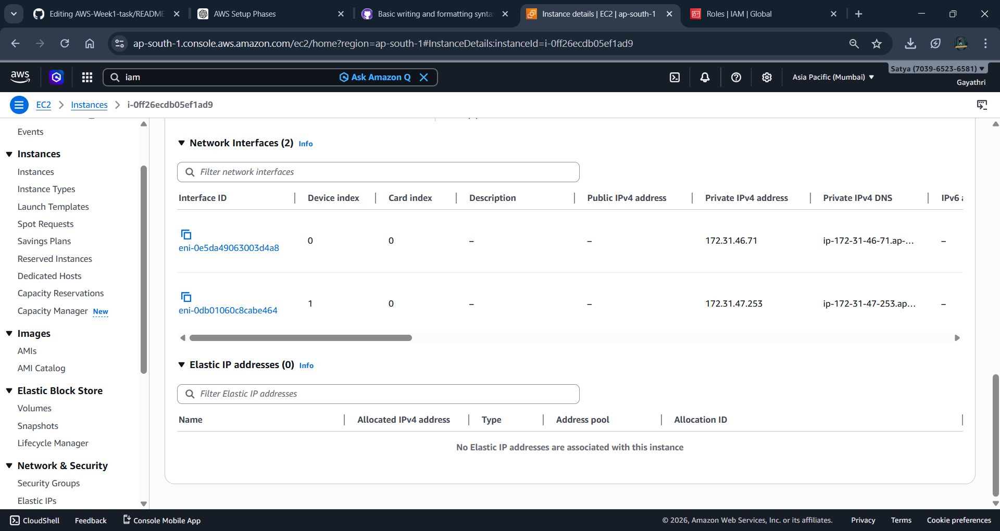

### Security Group Rules
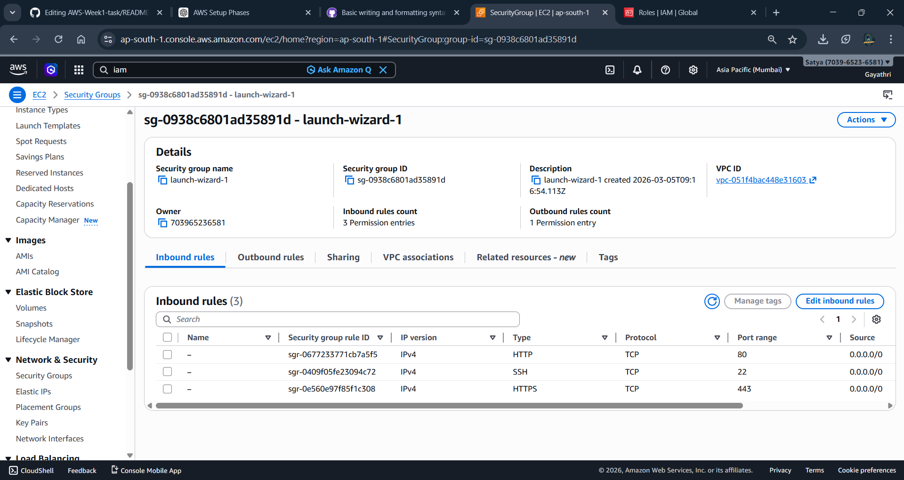
---

# Phase 6 — SSH Access

### SSH Login

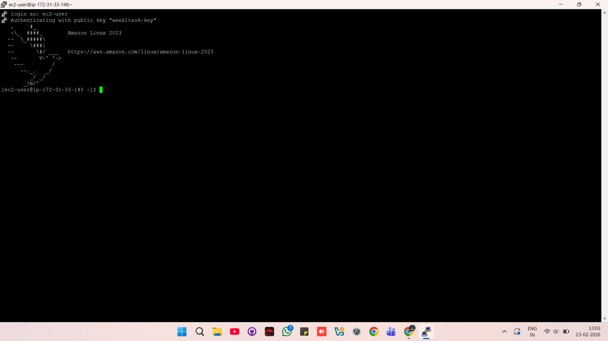

---

# Phase 7 — EC2 Replication

### AMI Creation

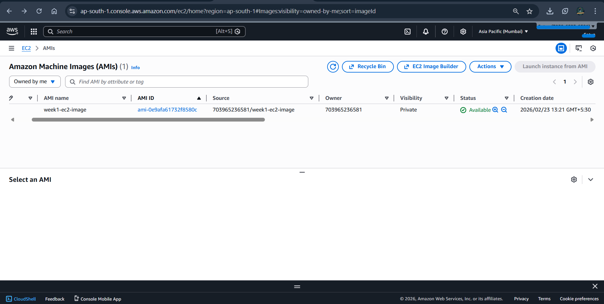

### Replicated Instances

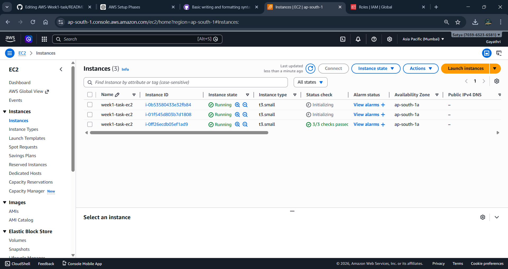

---

# Learning Outcomes

- Implemented IAM users, groups, and policies for secure access management
- Configured S3 bucket permissions using IAM policies
- Deployed and managed EC2 instances
- Modified instance type and storage volumes
- Configured networking using ENI and security groups
- Established secure SSH access to EC2 instances
- Replicated infrastructure using Amazon Machine Images (AMI)

---

# Author

Gayathri Ganeshan  
AWS Cloud Learner
