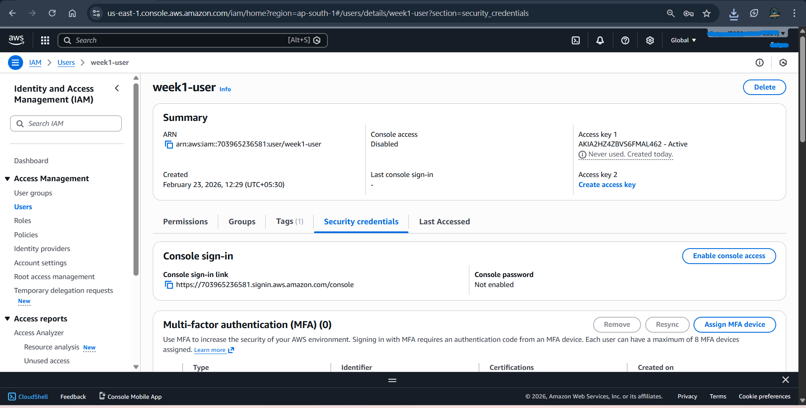
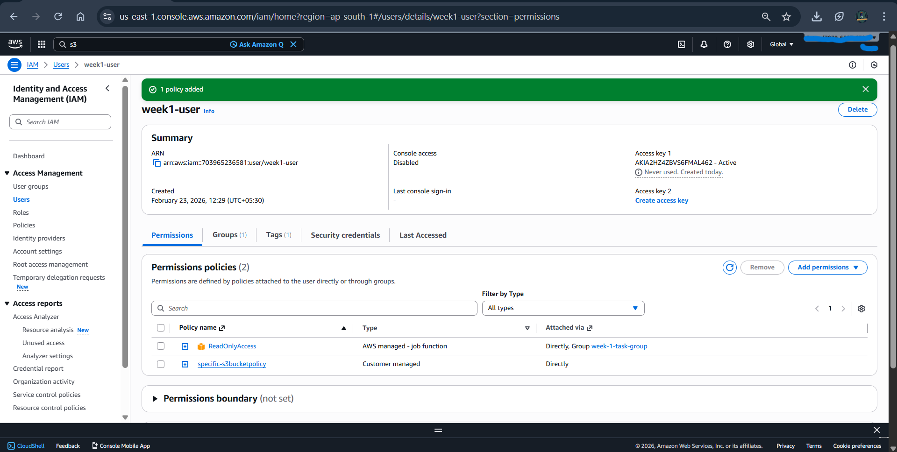
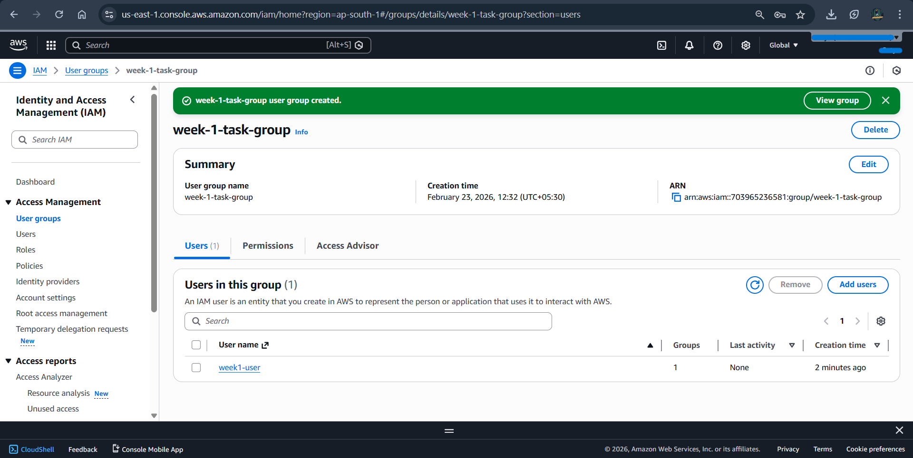

# AWS Week 1 Lab
## Phase 1 — IAM Setup

**Tasks Performed :**

1.Created an IAM user in AWS.

2.Generated Access Key ID and Secret Access Key for programmatic access.

3.Configured AWS CLI authentication using the generated credentials.

4.Created a custom IAM policy to allow read-only access to a specific S3 bucket.

5.Attached the policy to the IAM user.

6.Created an IAM user group.

7.Added the created user to the group.

8.Attached the ReadOnlyAccess policy to the group to allow read-only access to AWS services.

**Outcome**

Successfully configured IAM authentication and access control using policies and groups.

**Screenshots**
### IAM User Creation

### Access Key Generation

### AWS CLI Configuration

### IAM Policy Creation

### IAM Group Creation

